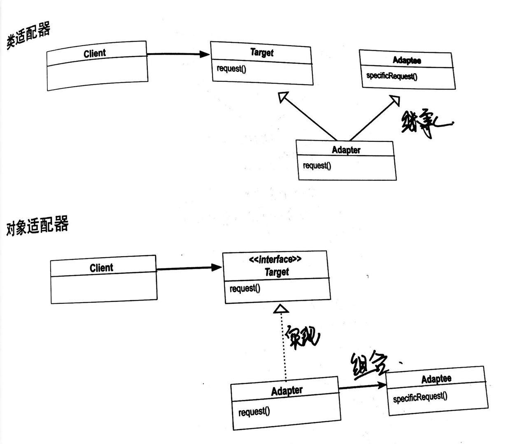

## 适配器模式

#### 定义 

将一个类的接口，转换成期望的另一个接口，解决接口之间的兼容问题；

#### 类图

适配器模式分两种，一种是对象适配器，另一种是类适配器；

对象适配器使用组合的方式，讲原实现组合到适配器中实现目标接口的方法；而累适配器通过适配器类同时集成原接口和目标接口来对外暴露目标接口的方法；

对象适配器的优点是：由于使用组合的方式，理论上原接口的任何子类都可以被用作组合对象；

#### 装饰者模式 和 适配器模式 比较

装饰着模式是在原有的接口上添加一些新的接口，丰富原接口，并不改变现有接口；而适配器是改变一个接口，使其符合目标客户的需要；

装饰者丰富一个接口，适配器模式转换一个接口；

