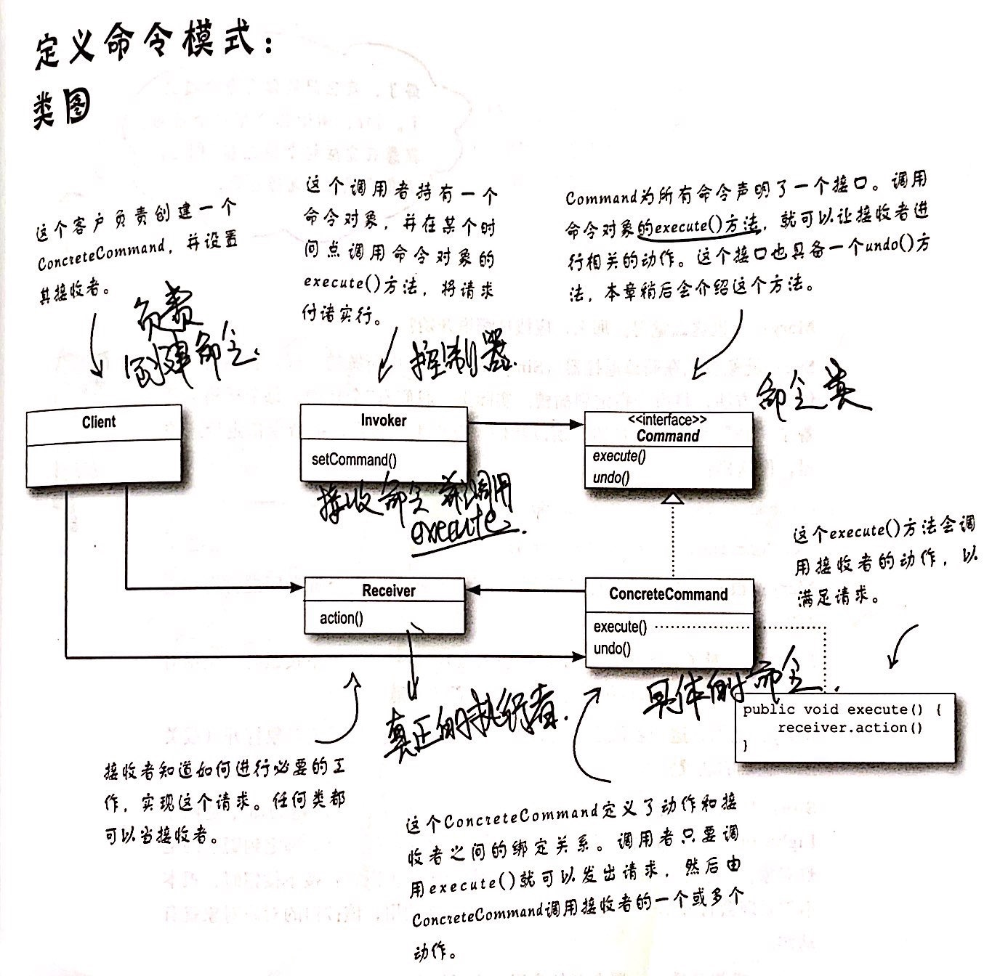

## 命令模式

### 概念

#### 出发点

将动作的执行者从动作的请求者对象中解耦，命令模式的请求者只关心如何发起请求，不关心请求的具体实现，甚至不关心请求具体的执行者是谁；

#### 实现方法

将请求封装成对象，对象实现Command接口，对外提供execute方法，请求的发起者只需调用此方法即可完成请求；

#### 定义

命令模式将请求封装成对象，以便使用不同的请求、队列或者日志来参数化其它对象。命令模式也可以支持撤销操作；

### 命令类图及角色

