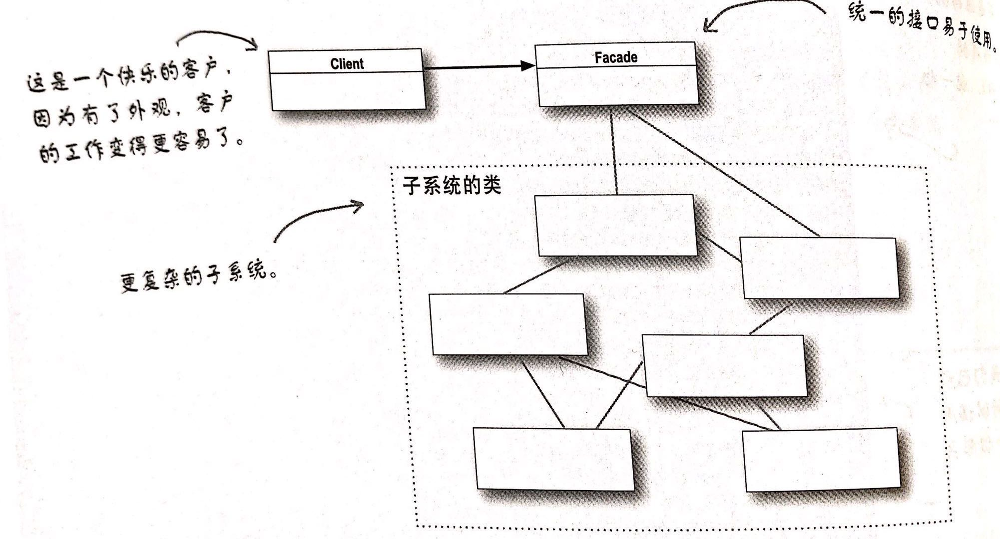

## 外观模式

#### 定义

外观模式提供一个统一的接口，用来访问子系统中的一群接口，外观定义了一个高层接口，让子系统更容易使用

#### 类图



外观模式没有封装子系统的累，只是提供了简化的接口，同时依然将系统完整的功能暴露出来，以供需要的人使用；

#### 举例

一个家庭影院系统，需要关联许多子系统，每个子系统都由一些接口和一些类组成；比如电源控制系统，视频播放、音频播放等；要完成播放电影的动作需要将子系统的方法组合起来才能完成，比如接通电源、放入碟片、打开视频、打开音频、设置音量等；为了简化家庭影院对外的接口，我们可以提供一个外观接口，将这些操作组合起来，对外提供简便的电影播放、关闭等接口；

```Go
type HomeTheaterFacade interface {
    WatchMovie()
    EndMovie()
}

type HomeTheaterFacadeImpl struct {
    power
    lights
    screen
    dvd 
    ...
}

type (impl *HomeTheaterFacadeImpl) WatchMovie() {
    power.On()
    lights.Off()
    screen.On()
    dvd.On()
    ...
}

type (impl *HomeTheaterFacadeImpl) EndMovie() {
    dvd.Off()
    screen.Off()
    lights.On()
    power.Off()
    ...
}
```