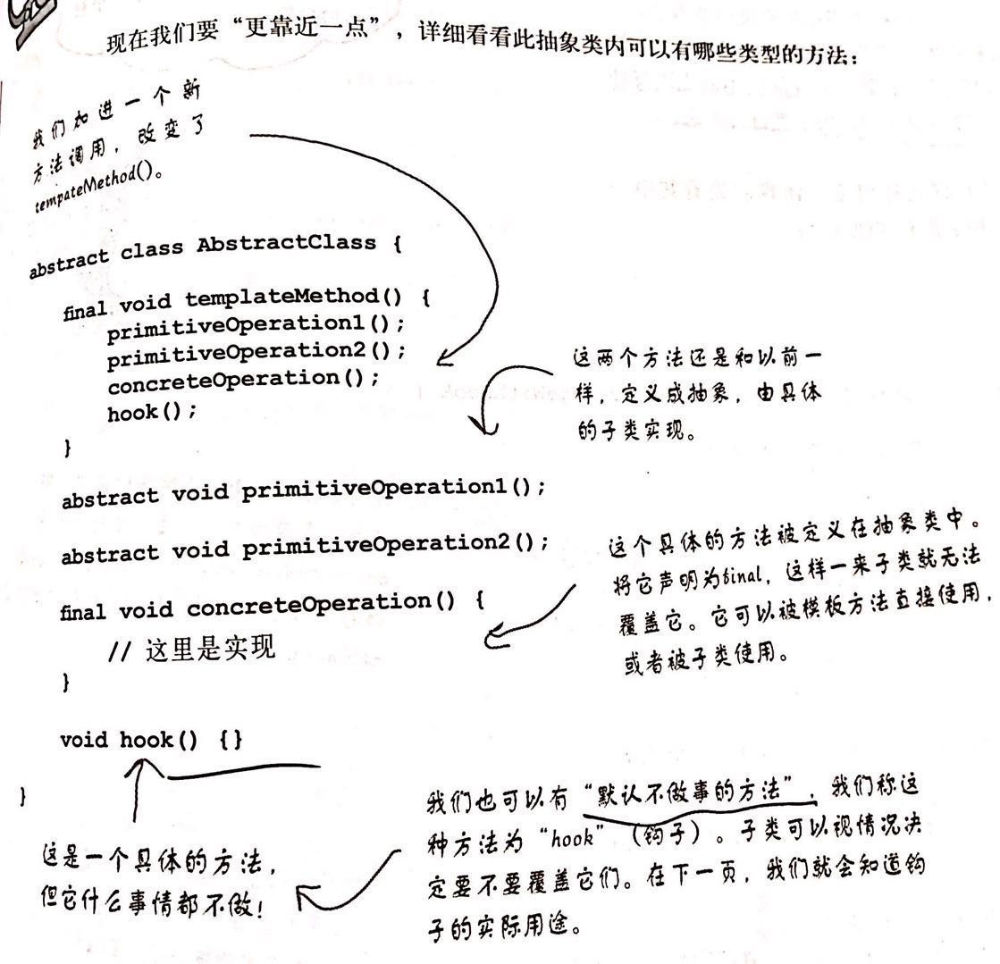

## 模板方法模式

### 定义

模板方法模式在父类的一个方法中定义一个算法的框架，而将该算法中的一些步骤延迟到子类中实现，模板方法使子类可以在不改变算法结构的情况下，重新定义算法中的某些步骤；

这个模式是用来创建一个算法的模板，模板就是一个方法，这个方法将算法定义成一组步骤，其中的任何步骤都可以是抽象的，由子类负责实现；这可以保证算法的接口不变，同时由子类提供部分实现；

### 结构图

### 模板方法中的钩子

钩子是一种被声明在父类中的方法，但只有空的或默认的实现；钩子的存在，可以让子类有能力对算法的不同点进行挂钩，或者改变算法的执行步骤；

什么时候使用子类必须实现的抽象方法，什么时候使用钩子呢？-- 当子类必须提供算法中的某个步骤时，使用抽象方法，如果算法的这个部分是可选的，就使用钩子；

